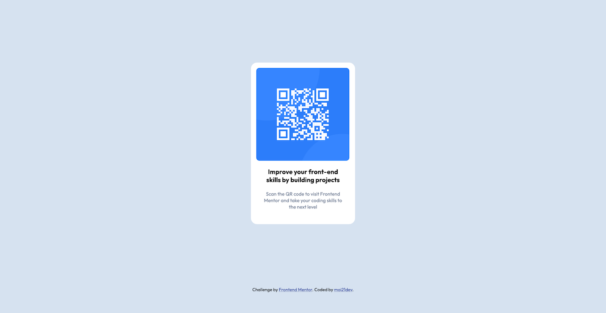

# Frontend Mentor - QR code component solution

This is a solution to the [QR code component challenge on Frontend Mentor](https://www.frontendmentor.io/challenges/qr-code-component-iux_sIO_H). Frontend Mentor challenges help you improve your coding skills by building realistic projects. 

## Table of contents

- [Overview](#overview)
  - [Screenshot](#screenshot)
  - [Links](#links)
- [My process](#my-process)
  - [Built with](#built-with)
  - [What I learned](#what-i-learned)
  - [Continued development](#continued-development)
  - [Useful resources](#useful-resources)


## Overview

### Screenshot

##### Desktop version


##### Mobile version


### Links

- Solution URL: [Add solution URL here](https://www.frontendmentor.io/solutions/qr-code-component-with-html-and-css-first-try-A6oSS8e_je)
- Live Site URL: [Add live site URL here](https://moi21dev.github.io/qr-code/)

## My process

### Built with

- Semantic HTML5 markup
- CSS custom properties

### What I learned

I've learned how to position a contanier in the center of the viewport.

```css
.card {
    margin: 20vh auto;
}
```

### Continued development

I'd like to understand how flexbox works and how to position the items in a more elegant and clean way.

### Useful resources

- [Center position](https://stackoverflow.com/a/48961075) - This helped me for positioning the div in the center of the viewport.
- [favicon in Github Pages](https://stackoverflow.com/a/61073510) - Github pages didn't show the favicon, and this answer was useful to solve the problem.